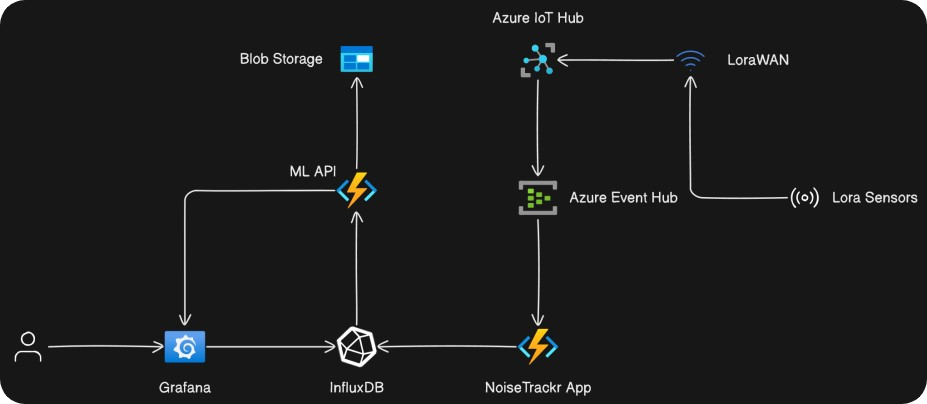

  

<h1></h1>

  <h2>IoT Project - NoiseTrackr</h2>

  <a href="#introduction-and-use-cases">Introducton and Use Cases</a> •
  <a href="#motivation">Motivation</a> •
  <a href="#mvp">Minimum Viable Product (MVP) </a> •
  <a href="#architecture">Architecture</a> •
  <a href="#how-to-setup">How to Setup</a> •
  <a href="#costs">Costs</a> •  
  <a href="#team-members">Team Members</a>

## Introduction and Use Cases
<b>Project Description</b>: NoiseTracker is a way to visualize the place and direction of noise in buildings, cities, regions, and countries. It provides the following:
 
<ul>
    <li><b>Displays</b> real-time spacio-temporal data with the use of heatmaps.</li>
    <li><b>Predicts</b> the noise in a given region for the next hours.</li>
    <li><b>Provides</b> graphs for real-time monitoring of noise in regions.</li>
</ul>

## Motivation
Touristic regions and attractions such as the Neuschwanstein Castle and Salzburg often suffer from environmental problems, such as <b>overcrowding, soil erosion, and noise pollution</b>. NoiseTrackr allows the Administrators of these areas to check the regions suffering from these problems and thus work upon making the tourism more sustainable.
 
 
Cities such as Memphis, USA and Rio de Janeiro, BRA suffer from <b>gun violence and gang related</b> incidents. With NoiseTrackr, authorities will be able to identify the location of gun shots and thus being able to intervene much quicker.
 
 
Nightly noise disturbances afflicts many apartment buildings and student dormitories. Whether it is parties, people talking too loud, music blasting, nobody likes to wake up at midnight due to these events. NoiseTrackr allows home owners and housemasters alike to identify which building block, apartment, or house is causing a noise disturbance.

## MVP
After a thorough discussion, the team has devised the following requirements for the Minimum Viable Product:
<ul>
  <li>Users receive noise insights through graphs and time-series + bar charts.</li>
  <li>Users can select the timeframe for their analysis.</li>
  <li>Users may select one or multiple regions at a time for analysis.</li>
  <li>Users have access to ML methods to forecast future noise in the selected regions.</li>
  <li>Users can be alerted if a selected region is exceeds a predefined noise level.</li>
  <li>The IoT devices should use LoraWAN.</li>
</ul>

## Architecture
The architecture of NoiseTrackr is build using the following tools:
<ul>
    <li><b>InfluxDB</b>: Database suitable for time-series data</li>
    <li><b>FastAPI</b>: Manages the fetching and sending of data between the client/raspberry and the database. Furthemore, provides security methods such as authentication and authorization. Lastly, it is used to instantiate the machine learning models for predictions.</li>
    <li><b>Grafana</b>: Creates and display the dashboards.</li>
    <li><b>Sound Sensor and CO2 Sensor</b>: The sensors are completely wireless and can measure sound level, temperature, humidity, CO2, light, and motion.The sound module is always on and will detect every sound event.</li>
    <li><b>Gateway</b>: receives messages from sensors and forwards them to the Network Server.</li>
    <li><b>Network Server</b>: manages the gateway, sensors, applications, and users in the LoraWAN network. </li> 
    <li><b>LoRa</b>: A low-power, long-range communication protocol used by IoT devices to wirelessly connect and transmit data over large distances with minimal power consumption.LoRa operates in specific frequency bands (868 MHz in Europe) and uses chirp spread spectrum (CSS) modulation to achieve long-range and high interference immunity. </li>
</ul>
All these tools are combined together to create the following architecture:

    

 

The client uses <b>Grafana</b> and a pre-made dashboard built by the team. This dashboard allows the user to insert his credentials and authenticate himself. If the authentication is succesful, Grafana will begin to fetch data by requesting the API and displaying it through graphs and other visualization methods.

The API itself plays a vital role within application. Firstly, it is the process responsible for getting data from the database (InfluxDB). While it would be possible to let Grafana connect directly to the database, this was considered unsafe and thus rejected. Furthemore, the API is used to instantiate machine learning models and send their predictions to the dashboard. Finally, the API is also meant to receive data from the raspberry pi's and store them within the database. The connection should be made using LoRa.

<h1>Team Members and Roles</h1>

## How to Setup
1) **Setting Up the Sensors**: CO2 LoRa Sensor and Sound Sensor Elsys
   - Power On: Insert batteries </b>
   - Find Device Keys: Use the manufacturer’s app to retrieve the unique Device EUI, App Key, and App EUI for each sensor. </b>
   - **Set up the Mikrotik Gateway** and configure it for LNS Basic Station.
   - Enter the necessary configuration details, including the Server URI provided by TTN
   - **Register the gateway and sensors on TTN**
   - Create an Application:Within your newly created application, go to the End Devices tab. Click Register End Device. Select the appropriate LoRaWAN version and Frequency plan. Repeat for each sensor.
   - **Confirm Connection**:
   - Check Gateway Status: Ensure the gateway shows as connected in the TTN Console.
   - Live Data: Confirm that you see uplink messages from your sensors indicating successful communication.
2) **TTN to Azure IoT Hub**: Configure TTN to forward sensor data to Azure IoT Hub. 
   - In TTN Console, go to your application and add an integration for Azure IoT Hub. 
   - Provide the required connection details for your Azure IoT Hub, such as the IoT Hub name and connection string.   

3) **Azure IoT Hub to Event Hub**: Set up routing in Azure IoT Hub to send data to Azure Event Hub.
3) **Event Hub to InfluxDB**: Use Azure Functions or Stream Analytics Jobs to process and forward data to InfluxDB.
4) **InfluxDB to Grafana**: Configure Grafana to connect to InfluxDB and create dashboards for data visualization.

This setup ensures that data from your sensors is effectively transmitted, processed, stored, and visualized using a combination of TTN, Azure services, InfluxDB, and Grafana.
<ul>
    <li><b>Gabriel Witte</b>: RestAPI setup and communication + ML operations </li>
    <li><b>Tafara Warren Machiridza</b>: Grafana setup and dashboard creation</li>
    <li><b>Victor Owolabi</b>: Network protocols and setup</li>
    <li><b>Saruni Fernando</b>: Database setup and design</li>
    <li><b>Luiza Landinger</b>: Register the sound sensor, CO2 sensor and the gateway on TTN </li>
</ul>

## Costs
Month: June

Total: €118.35 

Cost By Resource: 
- evhubns-thethingsnetwork: €39.95
- noisetrackr-hub: €39.95
- IoT Hub: €22.37
- Function app plan: €11.33
- Noisetrackr container registry: €4.62
- Storage Account: €11.33
- Function app plan: €0.12

